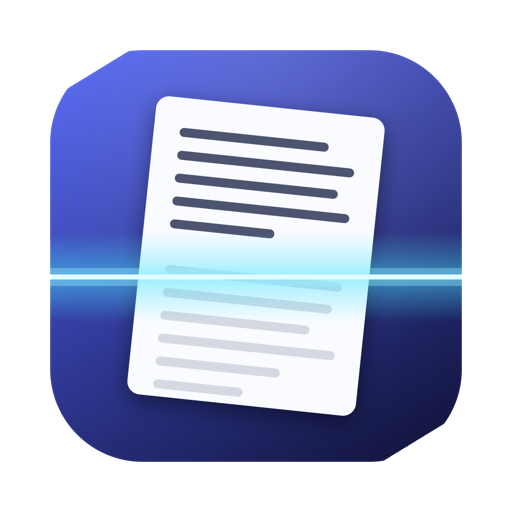
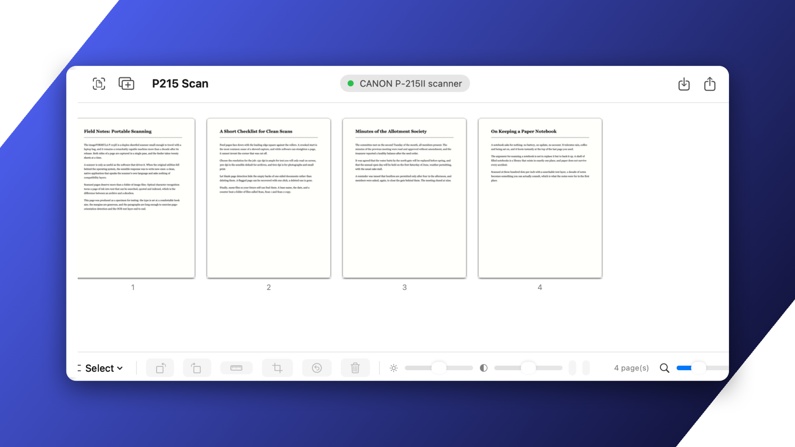
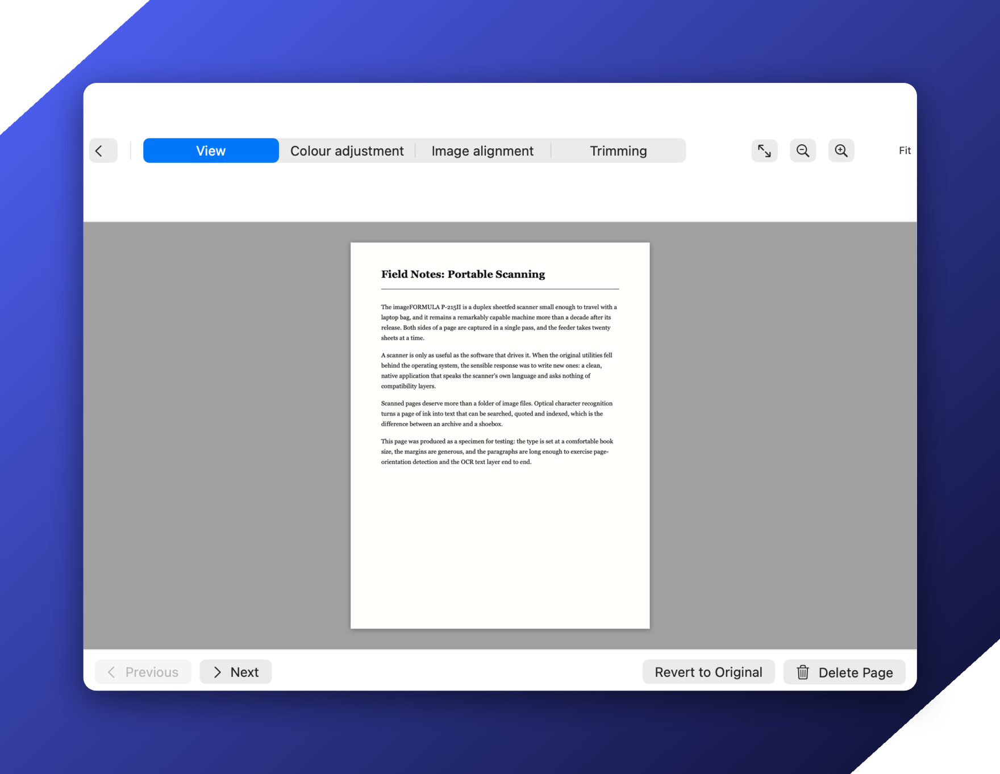

<p align="center">
  
</p>

<h1 align="center">P215 Scan</h1>

<p align="center">
  A native macOS app for the Canon imageFORMULA P-215II document scanner.
</p>

<p align="center">
  <a href="https://github.com/philipyaz/p215-scan/actions/workflows/build.yml"></a>
  <a href="https://github.com/philipyaz/p215-scan/releases"></a>
  <a href="LICENSE"></a>
  
</p>



Canon's CaptureOnTouch Lite is an x86_64 app from 2019 that only runs under
Rosetta. This replaces it with a native arm64 SwiftUI app: scan, tidy up,
export a searchable PDF — in one window instead of a three-step wizard.

> The reverse-engineered protocol specs are published in
> [`reference/protocol/`](reference/protocol/). The rest of `reference/` —
> Canon's binaries, their disassembly, and the ground-truth scans behind every
> tuning constant — exists only locally and is gitignored, because none of it
> is redistributable.

## Install

With [Homebrew](https://brew.sh) (installs the SANE backend too):

```bash
brew install --cask --no-quarantine philipyaz/tap/p215-scan
```

Or by hand: grab the zip from
[Releases](https://github.com/philipyaz/p215-scan/releases), drop
`P215 Scan.app` into `/Applications`, and `brew install sane-backends`.
Releases are not notarized (there is no paid Apple Developer account behind
this project); without `--no-quarantine` macOS will refuse the first launch
until you allow it under **System Settings → Privacy & Security → Open
Anyway**.

Or build from source — it is one `swiftc` invocation, no Xcode project:

```bash
git clone https://github.com/philipyaz/p215-scan.git
cd p215-scan/app && ./build.sh && open "build/P215 Scan.app"
```

## Setup

Put the scanner's rear **Auto Start** switch to **OFF**. It then enumerates as
a real scanner (USB `1083:165b`) and is driven through SANE's `canon_dr`
backend, which calibrates the sensor and gives clean images.

The app also works with Auto Start **ON**, over a reverse-engineered transport
(see below), but image quality is much worse there — that path exists because
it needs no switch flip, not because it is better.

## Features

CaptureOnTouch Lite parity, in one window instead of a three-step wizard.

| | |
|---|---|
| Colour mode | auto-detect, 24-bit colour, colour (photo), greyscale, greyscale (photo), black & white, error diffusion, text enhancement |
| Resolution | auto, 150, 200, 300, 400, 600 dpi |
| Page size | match original, A4, A5, A5R, A6, A6R, B5, B6, B6R, Legal, Letter, scanner maximum |
| Sides | simplex, duplex |
| Processing | skip blank pages, straighten, trim to contents, rotate to match text |
| Page editor | double-click a page: zoom/fit, rotate, straighten, trim, brightness, contrast, greyscale, B&W, revert |
| Selection | click, ⌘-click, shift-range, all / odd / even, delete with undo |
| Output | PDF, TIFF, JPEG, PNG; one file or N pages per file; compression standard/high with a 1–5 quality slider |
| OCR | 14 languages incl. mixed Japanese+English, invisible text layer, via Apple's Vision |
| File naming | base name + date (YYYYMMDD / MMDDYYYY / DDMMYYYY) + time + counter with digit count and start value |
| Presets | Text, Photo, Full auto, Black and White, Colour, plus your own — rename, duplicate, delete |
| One-click jobs | save a preset as a job: scan **and** save straight to its folder, no dialog |
| Page management | drag to reorder, delete with undo, blank pages flagged and hidden rather than discarded |

Shortcuts: **⌘R** scan, **⇧⌘R** scan more, **⌘S** save, **⌘I** import,
**⌘A** select all, **⌥⌘←** / **⌥⌘→** rotate, **⌘Z** undo delete,
**⌘,** preferences. (Rotate deliberately avoids `⌘[` / `⌘]` — those need a
modifier on Swiss, French and German layouts, so the shortcut silently did
nothing.)

**Import** adds existing images as pages, so the editing and export half works
with no scanner attached.



## Verified end to end

Against the physical scanner, a two-sided sheet (faint handwriting on one side,
dense French text on the other):

```
raw capture     2544x3300 px both sides (8.48 x 11.00 in @ 300 dpi)
ink coverage    0.04%  handwriting   |  10.58%  dense text
both sides kept, full size, correct colour
export          2-page searchable PDF, 610x792 pt per page
OCR             1092 characters extracted — including the handwriting
```

And driven through the app's own UI: import two pages, select all, rotate 180°,
save — producing `~/Documents/Scan_20260727_001.pdf` (2 pages, 610×792 pt,
verified with PDFKit) and ending on the completion banner with **Open** and
**Show in Finder**.

## Things that were wrong, and why

Each of these was measured, not guessed. They are recorded because every one of
them is a trap the next person will hit.

**`--swcrop` is destructive on this scanner.** canon_dr's software crop cannot
find the paper edges here — its calibration is too poor — so it crops to the
*ink* instead. A full 2544×3300 page came back as 494×440, losing everything but
a handwritten note. The app never sends it; "match original size" relies on the
scanner's own page-length detection, which is accurate, plus manual trimming in
the editor.

**Per-channel auto-levels destroys coloured paper.** Stretching each colour
channel to its own black/white point neutralises a colour cast for free, but on
a page with little spread in one channel those points collapse together and the
whole page saturates. It turned a white sheet with purple ink into solid yellow.
Levels are now measured on luminance and applied uniformly to all three
channels, so the black point is fixed and hue is left alone.

**The scanner's black point is badly lifted.** Raw scans have nothing darker
than luma ~161 — "black" text is mid-grey. `canon_dr` rates this model's
calibration as *poor* and this is what that means in practice. Auto-levels is on
by default for exactly this reason; without it every scan looks washed out.

**Blank-page detection must never delete.** It used to `continue` before
delivering the page, so a misjudged threshold destroyed real scans with no
count, no warning and no undo. Pages are now *flagged* and hidden behind a
"N blank page(s) hidden — Show" chip. The threshold also has to be far lower
than it looks: a sheet with a short handwritten note measures **0.04%** ink once
the paper edge is excluded, so anything above that hides real pages.

**Measure ink at a sensible resolution, ignoring the paper edge.** On a 200px
proxy a page of ordinary text averages into grey and reads as blank — a dense
page measured 0.12% and got discarded. At 1000px it measures 4.17%. The outer
3.5% must also be excluded: the ADF leaves a dark band along the edge that alone
reads as ~1.5% ink.

**Cancelling has to escalate to SIGKILL.** `Process.terminate()` sends SIGTERM,
which `scanimage` ignores while blocked in a USB read. Orphaned processes then
keep the USB device claimed, and every later detection fails — the scanner looks
like it has an unstable connection when nothing is wrong with it.

**Never poll the scanner with `scanimage -L`.** It *opens the USB device*.
Running it on a timer makes a healthy scanner flap between found and not-found,
and can wedge it entirely. Presence is now read from the IOKit registry, which
touches nothing on the bus, and a real probe only runs when presence changes,
with a 30 s → 5 min backoff on failure.

**Two Apple API traps.** `CGPDFContext` silently ignores a media box passed as
`NSValue` — it must be `CFData` wrapping a `CGRect`, or every page comes out US
Letter with the image overflowing. And Vision returns *zero* text observations
for images carrying an alpha channel, so pages are flattened onto white before
OCR.

## If the scanner stops responding

Unplug the USB cable and plug it back in. A jam or an interrupted transfer can
leave the device enumerated but no longer answering control transfers
(`sane-find-scanner` reports "could not fetch string descriptor"), and no
software reset clears it.

## The other transport

With Auto Start **ON** the scanner presents as a USB flash drive and no scanning
software can reach it. Canon's way around that is unusual and is fully reverse
engineered here: the fake `ONTOUCHLITE` volume's two 2 MiB files, `INDATA.dat`
and `transfer.dat`, are windows onto the scanner's command buffer, and the
firmware snoops the disk blocks behind them. The whole driver is plain POSIX
`read`/`write` — Canon's launcher imports no IOKit at all.

```
transfer.dat  0x00  24-byte command block (12-byte header + 12-byte SCSI CDB)
              0x18  4-byte status doorbell
              0x1C  data-out block, payload at 0x28
INDATA.dat    0x00  data-in payload
```

The framing is byte-identical to `canon_dr`'s USB bulk framing, so the whole
Canon DR command set applies. This works — a real page was scanned through it —
but the analogue front end has to be programmed by the host, and the three-pass
coarse calibration wedges this unit, so images come out pale and banded. Detail
in [`reference/protocol/PROTOCOL.md`](reference/protocol/PROTOCOL.md) and
[`reference/protocol/SCANSEQ.md`](reference/protocol/SCANSEQ.md).

## Layout

```
app/
  Sources/SaneBackend.swift   scanimage transport (the good path)
  Sources/Tunnel.swift        file-tunnel SCSI transport
  Sources/ScanEngine.swift    SET WINDOW / SCAN / READ, de-interlacing, calibration
  Sources/ImagePipeline.swift Core Image rendering, thumbnails, levels, deskew, ink
  Sources/Orientation.swift   Vision-based page orientation
  Sources/Export.swift        PDF / TIFF / JPEG / PNG, Vision OCR text layer
  Sources/USBPresence.swift   IOKit presence, no bus traffic
  Sources/Snapshot.swift      headless UI screenshots, no permissions needed
  Sources/*View*.swift        SwiftUI interface
  Sources/CLI/main.swift      headless harness
  build.sh / build-cli.sh / make-icon.sh
p215                          SANE-based Python CLI

reference/
  protocol/                   PROTOCOL.md (file tunnel), SCANSEQ.md (scan
                              sequence) — published, our own write-up
  …                           everything else (Canon's originals, disassembly,
                              captures, measurements) is local-only and
                              gitignored: not redistributable
```

The CLI harness is the fastest way to test hardware changes:

```bash
cd app && ./build-cli.sh
./build/p215cli sane            # what SANE sees
./build/p215cli sane-scan o.pdf # full scan + export
./build/p215cli diag ~/diag     # raw scan, no processing, reports every measurement
./build/p215cli hist page.png   # full-res luminance histogram
./build/p215cli orient page.png # detected rotation
./build/p215cli probe           # tunnel-mode device identity
```

## Contributing

Issues and pull requests are welcome — especially reports from other
`canon_dr`-driven scanners (DR-series, P-208II, P-150), which this app may
drive with little or no change. If your scanner misbehaves, the output of
`p215cli diag` is the most useful thing you can attach.

## Buy me a beer

This app exists because a perfectly good scanner deserved better software. If
it saved yours from the drawer, you can
[sponsor the project on GitHub](https://github.com/sponsors/philipyaz) — beer
money, not a business.

## License and trademarks

[MIT](LICENSE). Canon, imageFORMULA and CaptureOnTouch are trademarks of Canon
Inc. This project is not affiliated with, endorsed by, or supported by Canon.
It contains no Canon code; the hardware protocol was reverse engineered for
interoperability, and Canon's own software is deliberately excluded from this
repository.
